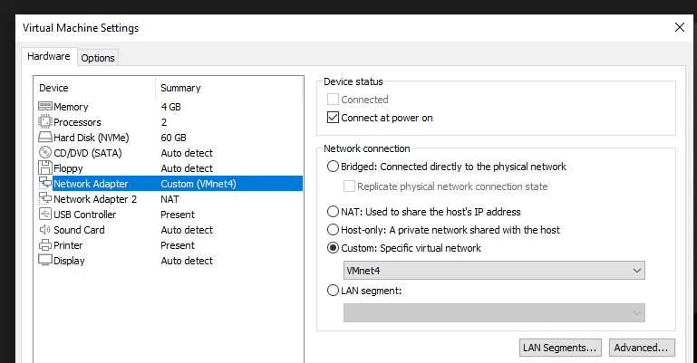
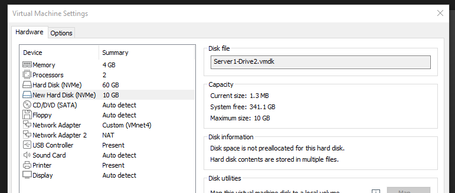
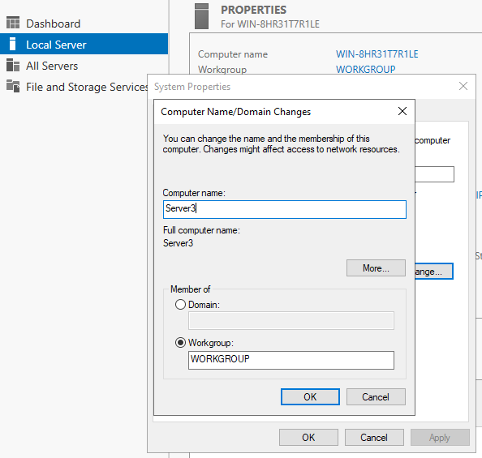
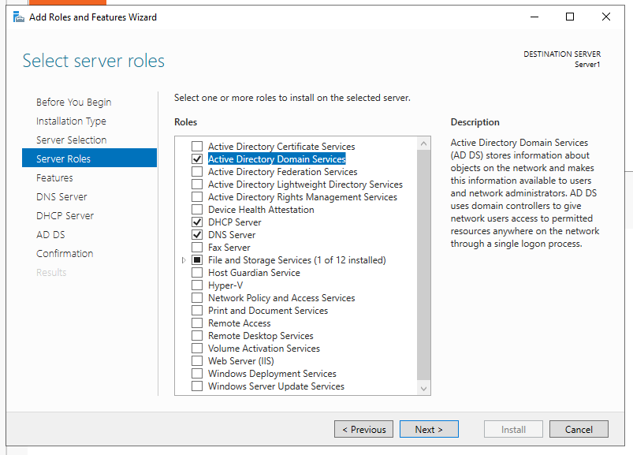
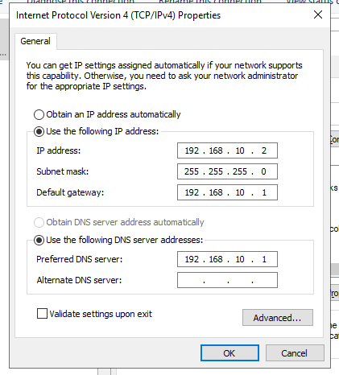
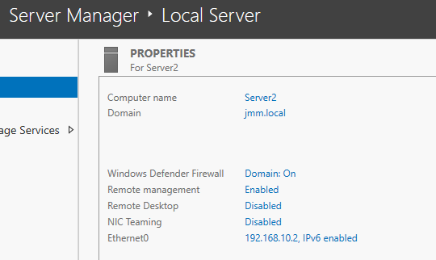

# :desktop_computer: Serverteknologi-HF2

Af Mark, Jacob & Mads

## Indhold:
* [Del-1](#Del-1)
	* [VMWare](#vmware)
	* [IP Table](#ip-table)
	* [Server opsætning](#server-opsætning)
* [Del-2](#)
	* [Underpunkt-1](#)
* [Del-3](#)
	* [Underpunkt-1](#)
* [Del-4](#)
	* [Underpunkt-1](#)
* [Del-5](#)
* [Del-6](#)
* [Del-7](#)
* [Del-8](#)
* [Del-9](#)
* [Del-10](#)
* [Del-11](#)
	* [Underpunkt-1](#)
	* [Underpunkt-2](#)
* [Del-12](#)

## Del-1
### VMWare
Opretter et extra netkort på Server1 og sætter det til Custom (VMnet4).

 
Tilføjer en extra harddisk på Server1.

### IP Table
| Navn          | IP adresse    | DNS          | Gateway      | Subnet       |
| ------------- |:-------------:|:-------------|:-------------|:-------------:
| Server1       | 192.168.10.1  | 127.0.0.1    | 127.0.0.1    | 255.255.255.0|
| Server2       | 192.168.10.2  | 192.168.10.1 | 192.168.10.1 | 255.255.255.0|
| Server3       | 192.168.10.3  | 192.168.10.1 | 192.168.10.1 | 255.255.255.0|
| Client1       | DHCP          | 192.168.10.1 | 192.168.10.1 | 255.255.255.0|
### Server opsætning
Omdøber server nummer 3, til Server3. (Det gør vi for alle 3 servere inden vi går videre med opsætningen).

 
Vælger server roller på Server1. ADDS, DHCP og DNS.

Sætter statisk IP på Server2 og Server3.
 

 
Tilføjer Server2 og Server3 til domænet jmm.local.

## Del-2
Opsætning af DNS Forward Lookup Zone (FLZ) og Reverse Lookup Zone (RLZ) for vores domæne.
 
 
Installerer DNS op på Server2.
